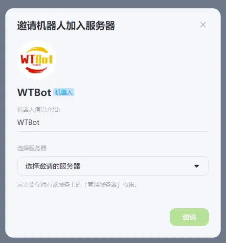

# 快速开始

我们将会带领你快速了解 WTBot 的使用方法。

## 直接开始使用

如果你之前有类似的使用经验，那么你可以直接点击下面的链接邀请机器人加入群组，并开始使用。

[邀请 WTBot 加入群组](https://www.kookapp.cn/app/oauth2/authorize?id=18172&permissions=940036&client_id=RnGyW8m5Vq8b35YD&redirect_uri=&scope=bot)

如果你对 KOOK 平台，聊天机器人等概念并不清楚，那么我们建议你继续阅读下去。下面的内容将带领你快速了解 WTBot 的使用方法。

## 从零开始

如果你是第一次使用 WTBot，那么你需要完成以下的几个步骤。

### 拥有 KOOK 账号

KOOK 是一个语音社交平台，类似于 QQ、微信等社交软件。虽然比较小众，但是在游戏玩家中有一定的用户群体，并且对机器人的支持也比较友好。所以，WTBot 选择了 KOOK 平台作为主要的服务平台。

:::info 支持更多平台
我相信有很多人希望我们支持 QQ，QQ 也确实推出了 QQ 机器人这一功能， 并且在 QQNT 版本中作为主要功能点推荐给用户。

但是 QQ 机器人的审核比较严格，需要企业资质，开发成本较高，因此我们暂时没有计划支持 QQ 机器人。
:::

因此，如果你想要使用 WTBot，首先你需要一个 KOOK 账号。你可以找到 [KOOK 官网](https://www.kookapp.cn/)，并遵循指示注册一个账号，具体的注册方法这里不再赘述。

我们假设你已经有了 KOOK 账号，那么就可以继续下一步了。

### 创建或者加入一个群组

KOOK 和传统的 QQ 群类似，都有群组（也可以叫做服务器，为了防止混淆概念，下面我们均称为群组）的概念。WTBot 是一个聊天机器人，它的大部分功能是依托群组内的聊天实现的，因此，你需要一个群组来和 WTBot 交流。

同样，你可以依据 KOOK 的指示创建一个群组，又或者是加入别人的群组。不过如果你选择加入别人的群组，你将没有权限邀请机器人加入。

:::warning 权限问题
KOOK 平台规定，只有服务器的创建者或者管理员才有权限邀请机器人加入群组。
:::

如果你不知道怎么做，又或者是觉得创建群组太麻烦了，你可以选择直接加入 WTBot 的交流群组。点击下方的链接即可加入。

[加入 WTBot 交流群组](https://kook.top/eUTZK7)

### 邀请 WTBot 加入群组

当你有了一个拥有“创建者”或者“管理员”权限的群组后，你就可以邀请 WTBot 加入群组并提供服务了。

这一步很简单，还记得页面最上方的链接吗？不记得也没关系，下面的链接也一样。

[邀请 WTBot 加入群组](https://www.kookapp.cn/app/oauth2/authorize?id=18172&permissions=940036&client_id=RnGyW8m5Vq8b35YD&redirect_uri=&scope=bot)

点击链接，将会打开一个新的网页，你只需要选择你刚刚创建或者加入的群组，然后点击“邀请”按钮即可。

界面如下所示：



### 开始使用

当机器人第一次加入到你的群组后，将会发送一条欢迎消息。在收到欢迎消息后，你就可以开始使用了。

使用的方式很简单。找到一个文字频道，并在聊天框中输入以下命令并发送：

```bash
/wt help
```

机器人将会回复你一个卡片信息，告诉你如何使用 WTBot。看到消息，就代表着一切正常，你可以继续使用 WTBot 的其他功能了。更多的命令和功能，你可以查看 [命令列表](/docs/category/命令列表)。

## 问题反馈

当然，不是所有情况下都是一帆风顺的。如果你发现机器人的表现不正常，那么可能有多种因素影响了它。此时，我们建议你首先按照以下条目进行检查，以便先排除一些简单的错误导致的问题：

- [ ] 检查机器人是否正确加入到群组中
- [ ] 检查你发送的消息格式是否正确
- [ ] 检查机器人是否有权限在你所在的频道中发送消息

如果你发现实在无法通过自己的力量解决问题，那么你可以反馈问题或者寻求帮助。我们提供了以下几种渠道：

- 加入 WTBot 的社区反馈。在文档站点最下方的社区栏目中，你可以很方便找到位于不同平台的社区的加入链接。加入社区，遵循指示反馈问题，开发者将在看到问题后尽快回复。
- 在 GitHub 上提交 Issue。直接向开发者提交 Issue 是一个非常程序员的方式，请仅在认为是机器人本身的程序问题时这么做。
